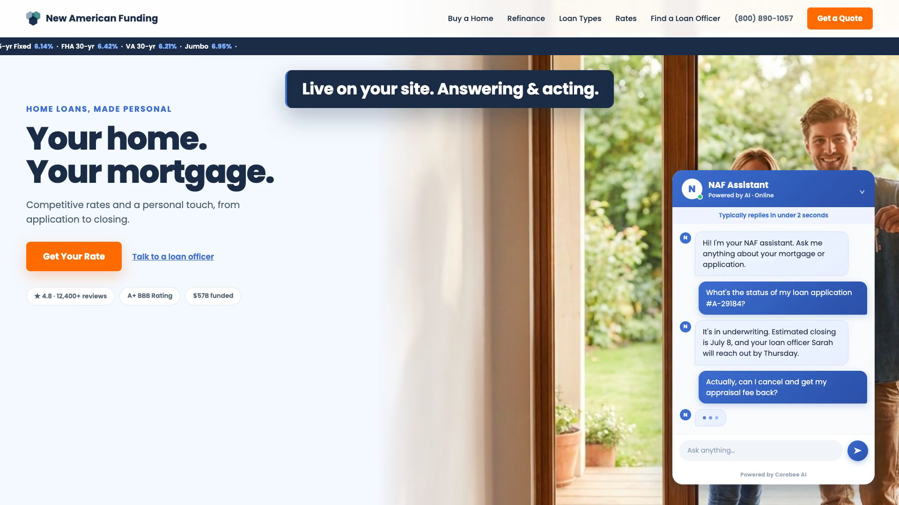

# Demo Video Factory

Drop any SaaS URL → get a custom ~26s product demo video in minutes.

Built with **Claude Code + Remotion**. Each video is themed to *that* product — its real brand colors, fonts, logo, screenshots, copy, a recreated product‑UI scene, and a custom soundtrack.

```
/demo https://linear.app   →   out/demo_linear.mp4
```

## Example output

[](examples/corebee-demo.mp4)

*Made with this tool — a demo for our own product, [Corebee](https://corebee.ai). ([watch the MP4](examples/corebee-demo.mp4))*

---

## How it works

The visual quality comes from fixed, hand‑built scene **templates** (`src/templates/scenes.tsx`). The AI's only job is to write a small **`brief.json`** (data: brand, copy, layout choices) — it never writes scene code. That's what keeps every video high‑quality *and* unique.

1. **Scan** (`agent/scan.ts`) — Playwright opens the site and captures real screenshots, computed brand colors + fonts, the logo, and a short screen recording.
2. **Scrape** (`agent/scrape.ts`) — pulls title, headings, and copy.
3. **Brief** — the Claude Code agent writes `out/<slug>_brief.json` (data only).
4. **Music** (`agent/music.ts`) — a procedural, per‑product soundtrack (needs `ffmpeg`).
5. **Assemble** (`agent/assemble-templated.ts`) — fills the templates from the brief → `src/generated/`.
6. **Render** — Remotion renders `out/demo_<slug>.mp4` (1920×1080, with audio).

### The 4 scenes
- **Pain** — the problem, tinted to the brand. Layouts: `cards` (notification chaos) · `tabs` (tool sprawl) · `stack` (cost ledger).
- **Reveal** — logo lockup + the real product screenshot in a clean browser frame. Layouts: `browser` · `split` · `fullbleed`.
- **Wow** — the product's actual UI, **recreated in code and themed to the brand**: `scheduling` · `pipeline` (ATS/CRM) · `formbuilder` · `designstudio`. Falls back to a screenshot‑based scene (`checklist` · `beforeafter` · `gallery`) when no recreation fits.
- **Outcome** — the headline result + CTA. Layouts: `stat` · `metrics`.

---

## Requirements

- **Node.js 18+**
- **ffmpeg** — for the soundtrack (must be on your `PATH`):
  - macOS: `brew install ffmpeg`
  - Debian/Ubuntu: `sudo apt-get install ffmpeg`
  - Windows: `winget install Gyan.FFmpeg` (or download from [ffmpeg.org](https://ffmpeg.org/download.html))
- **Claude Code** (for the recommended `/demo` flow):
  ```bash
  npm install -g @anthropic-ai/claude-code
  claude login
  ```

## Setup

```bash
git clone https://github.com/jonny-1812/demo-video-factory
cd demo-video-factory
npm install          # also runs `playwright install chromium`
```

`npm install` downloads a Chromium build for the scanner. The repo ships with a
placeholder composition so it compiles immediately — `remotion studio` works
before you ever run `/demo`.

---

## Usage

Open the repo in **Claude Code** and run:

```
/demo https://yourproduct.com
```

That's it. The agent you're already talking to does the AI work itself (writes the
brief, picks the layouts) — **no API key, no subprocess, no login juggling**. It
shells out only to scan, scrape, build music, and render. Output: **`out/demo_<slug>.mp4`**.

Prefer to drive it by hand? The individual steps are also npm scripts:

```bash
npm run scan https://yourproduct.com     # screenshots + brand + logo
npm run scrape https://yourproduct.com   # copy
# write out/<slug>_brief.json  (see samples/placeholder_brief.json for the shape)
npm run music <slug>                     # soundtrack
npm run assemble <slug>                  # fill the templates
npm run render                           # → out/demo.mp4
```

---

## Output

- 1920×1080 MP4, ~26 seconds, with a custom soundtrack.
- Generation takes ~4–6 minutes (most of it is the Remotion render).
- Scanned assets land in `public/real/<slug>/` and the brief in `out/<slug>_brief.json` (both gitignored / per‑run).

## Notes

- `src/generated/` is committed with a placeholder default so a fresh clone compiles. `/demo` overwrites it each run — that's expected; you don't need to commit those local changes.
- The example in `examples/corebee-demo.mp4` was made with this exact tool — it's a real demo for [Corebee](https://corebee.ai), the product we build. Run `/demo https://yourproduct.com` to make your own.
- If a site serves a text‑only page to headless browsers (bot protection), the scan flags `textOnly` and you can drop your own screenshots into `public/real/<slug>/`.
- Add a new recreated product‑UI type by adding a component to `src/templates/scenes.tsx` and registering it in the `PRODUCT_UI` map.

## Project structure

```
agent/
  scan.ts                — Playwright: screenshots, brand, fonts, logo, screen recording
  scrape.ts              — text content
  music.ts               — procedural per‑product soundtrack (ffmpeg)
  assemble-templated.ts  — fills the templates from out/<slug>_brief.json
  record.ts              — records the live product in motion
src/
  templates/scenes.tsx   — the scene templates (Pain / Reveal / Wow / Outcome + variants)
  generated/             — composition built from the brief (placeholder committed)
  Root.tsx               — Remotion root (DynamicDemo composition)
.claude/commands/demo.md — the /demo slash command
out/                     — rendered videos (gitignored)
public/real/<slug>/      — scanned assets (gitignored)
```

---

## Built by Corebee

This tool is free and built by the team behind **[Corebee](https://corebee.ai?utm_source=demo-video-factory&utm_medium=readme&utm_campaign=oss)** — AI customer support for SaaS, **$99/mo flat** (no per‑seat fees). One script tag, answers grounded in your own docs (not hallucinated), and it escalates to you only when it matters.

Just shipped your product? When the people who watch your new demo show up with questions, Corebee answers them 24/7 — so a solo founder never drowns in support. 14‑day free trial, 30‑day money‑back, most teams go live in ~11 minutes.

**Set up your support agent → [corebee.ai/terminal](https://corebee.ai/terminal?utm_source=demo-video-factory&utm_medium=readme&utm_campaign=oss)**

MIT License.
